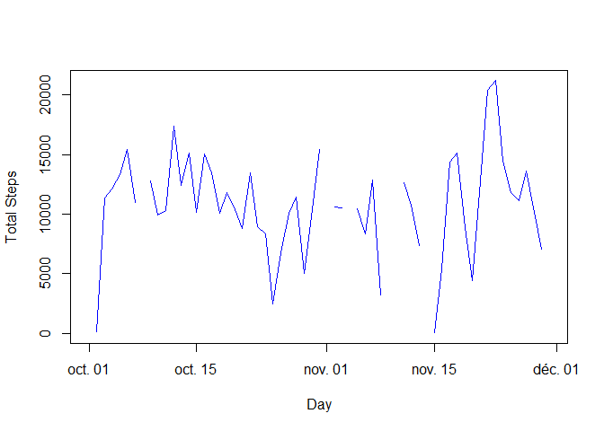

# Reproducible Research: Peer Assessment 1


## Loading and preprocessing the data


```r
# Some initialisations. The initial file is a zip provided in the repo
InDirectory <- "Z:/Professionnel/Cours/repos/RepData_PeerAssessment1"
ZipFile <- "activity.zip"
FullZip <- paste(InDirectory,"/", ZipFile, sep="")
CSVFile <- "activity.csv"
FullCSV <- paste(InDirectory,"/", CSVFile, sep="")
# Unzip the file
unzip(FullZip, exdir=InDirectory)
# Read the CSV in data
data<-read.csv(FullCSV)
```

## What is mean total number of steps taken per day?

```r
PerDay <-with(data, tapply(steps, date, sum, na.rm=TRUE))
plot(PerDay, type="l", col="blue", xlab= "Day", ylab="Total Steps")
abline(h=mean(PerDay), lwd=2, col="green")
```

<!-- -->

## What is the average daily activity pattern?


## Imputing missing values


## Are there differences in activity patterns between weekdays and weekends?
