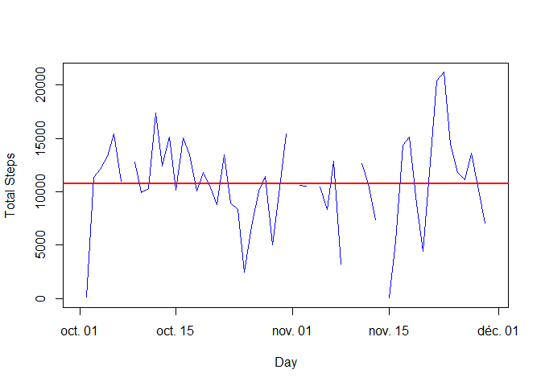
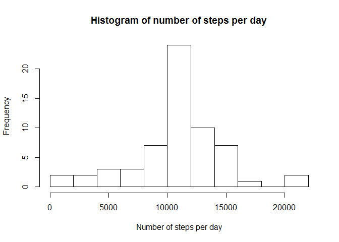

# Reproducible Research: Peer Assessment 1


## Loading and preprocessing the data


```r
# Some initialisations. The initial file is a zip provided in the repo
library(lattice)
InDirectory <- "Z:/Professionnel/Cours/repos/RepData_PeerAssessment1"
ZipFile <- "activity.zip"
FullZip <- paste(InDirectory,"/", ZipFile, sep="")
CSVFile <- "activity.csv"
FullCSV <- paste(InDirectory,"/", CSVFile, sep="")
# Unzip the file
unzip(FullZip, exdir=InDirectory)
# Read the CSV in data
data<-read.csv(FullCSV,colClasses = c("integer", "Date", "integer"))
```

## What is the mean total number of steps taken per day?

```r
PerDay <- aggregate(steps~date, data=data, sum, na.action=NULL)
DailyMean <- mean(PerDay$steps, na.rm=TRUE)
DailyMedian <- median(PerDay$steps, na.rm=TRUE)
cat(" Daily mean number of steps: ",DailyMean, "\n", "Daily median number of steps: ",DailyMedian)
```

```
##  Daily mean number of steps:  10766.19 
##  Daily median number of steps:  10765
```
The graph displays the daily number of steps as the blue line. The missing values are clearly visible as interruption of the line.
2 lines respectively mark the average and the median, but, as the values are nearly equal, they are undistinguishable.


```r
plot(PerDay, type="l", col="blue", xlab= "Day", ylab="Total Steps")
abline(h=DailyMean, lwd=2, col="green")
abline(h=DailyMedian, lwd=2, col="red")
```

<!-- -->

## What is the average daily activity pattern?


```r
PerInterval <- aggregate(steps~interval, data=data, mean)
plot(PerInterval, type="l", col="blue", xlab= "Interval", ylab="Average Steps")
```

<!-- -->

```r
cat("Maximum Activity interval: ",PerInterval$interval[which.max(PerInterval$steps)])
```

```
## Maximum Activity interval:  835
```

## Imputing missing values

Number of missing values

```r
cat("Nummber of missing values: ", length(data$steps[is.na(data$steps)]))
```

```
## Nummber of missing values:  2304
```

Filling the missing values

We have already calculated the average number of steps for each interval. We calculate the number of steps for each day as well as the average number of steps per day. 
For the days for which we have no value, we assign the average number of steps per day as total number of steps for the day.
We then fill the missing values by assigning the average number of steps for the interval, multiplied by the number of steps for the day and divided by the average number of steps per day.


```r
# Calculate the daily average
PerDay$steps[is.na(PerDay$steps)]<-DailyMean
# Assign the number of steps to the empty intervals
y<-merge(data[is.na(data$steps), c("steps", "date", "interval")], PerInterval, by="interval")
y<-y[with(y,order(date, interval)),]
# Assign the number of steps of the day
z<-merge(y[, c("steps.y", "date", "interval")], PerDay, by="date")
# Copy the initial data to a new frame
imputteddata<-data
# Assign the calculated values to the empty intervals
imputteddata$steps[is.na(data$steps)]<-z$steps.y*z$steps/DailyMean
PerImputedDay <- aggregate(steps~date, data=imputteddata, sum, na.action=NULL)
DailyImputedMean <- mean(PerImputedDay$steps)
DailyImputedMedian <- median(PerImputedDay$steps)
hist(PerImputedDay$steps, breaks=10, xlab="Number of steps per day", main="Histogram of number of steps per day")
```

<!-- -->

```r
cat(" Daily mean number of steps (after imputing): ", DailyImputedMean, "\n", "Daily median number of steps (after imputing): ", DailyImputedMedian)
```

```
##  Daily mean number of steps (after imputing):  10766.19 
##  Daily median number of steps (after imputing):  10766.19
```

Imputing data has not changed the mean. This was expected, as the imputing strategy is based on means and is devised to keep is unchanged. The median is only very slightly modified.

## Are there differences in activity patterns between weekdays and weekends?


```r
# define weekend (in my French locale)
weekend<-c("samedi", "dimanche")
# create a new factor column with the split weekend/weekday
imputteddata$day<-factor((weekdays(imputteddata$date) %in% weekend), levels=c(TRUE, FALSE), labels=c('weekend', 'weekday'))
PerWeekday <- aggregate(steps~interval+day, data=imputteddata, mean)
xyplot(steps~interval|day, PerWeekday, type="l", layout=c(1,2))
```

<!-- -->

The activity on weekday peeks around 08:35 and is significanly lower after about 09:30.  
During weekends, the activity is shifted later and spread more evenly during the day.
